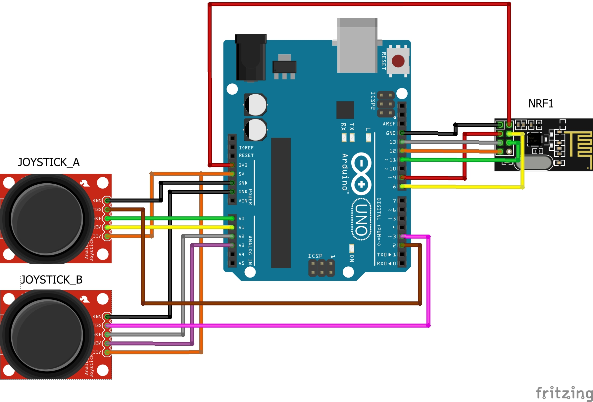
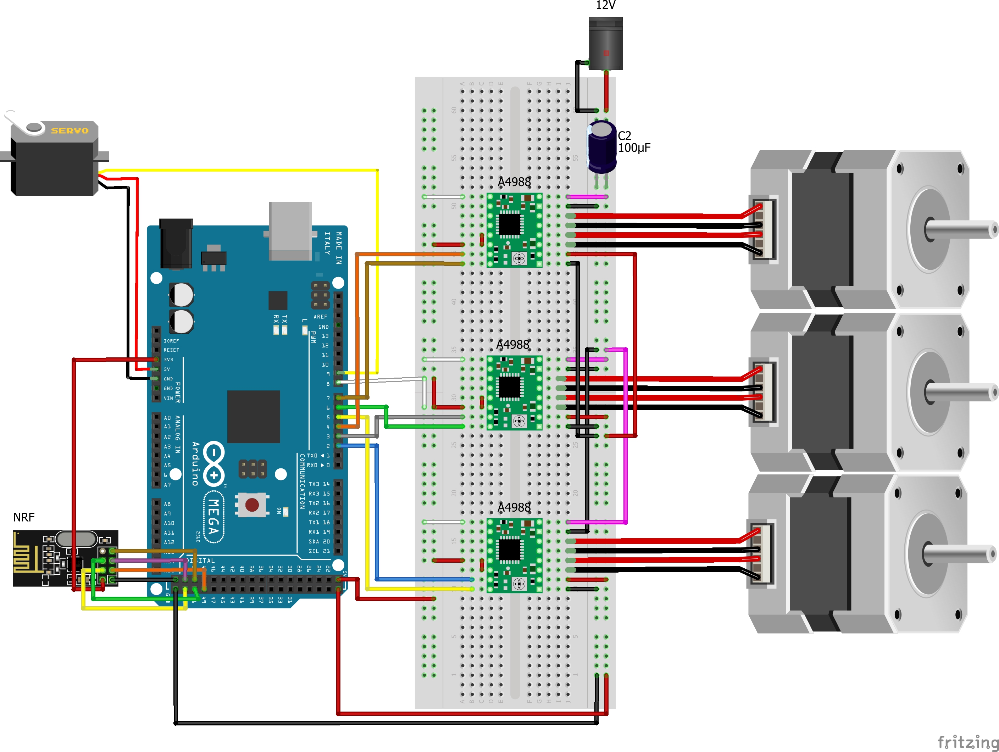

# 🤖 RF Motor Control System - 2.4GHz Robotic Arm Controller

 

*Note: This project was developed as part of an educational mentoring program for hardware engineering students.*

---

## 🇬🇧 English Version

A robust 2.4GHz wireless control system designed to operate a multi-axis robotic arm. The system features a custom-built dual-joystick transmitter and a multi-driver receiver capable of handling 3 stepper motors and 1 servo simultaneously with low latency.

### 🚀 Key Technical Specs
* **Wireless Protocol:** 2.4GHz RF communication via NRF24L01 modules, utilizing formatted string payloads for multi-axis data transmission.
* **Performance:** Achieves a fast response time (~60ms latency) and a stable operational range of up to 85 meters.
* **Actuator Control:** Precise step/direction generation for 3 independent stepper motors via A4988 drivers, coupled with smooth gradual angle control for a gripper servo.
* **Data Parsing:** Real-time extraction of analog coordinate data (`A (x,y); B (x,y)`) using `sscanf` for efficient logic mapping.

### 🛠️ System Architecture

**1. Transmitter Unit (Remote Control)**
* **Core:** Arduino Uno
* **Input:** 2x Analog Dual-Axis Joysticks
* **Communication:** NRF24L01 (Tx Mode)

**2. Receiver Unit (Motor Controller)**
* **Core:** Arduino Mega 2560
* **Drivers:** 3x A4988 Stepper Motor Drivers (with 100µF decoupling capacitors for stability)
* **Actuators:** 3x NEMA Stepper Motors, 1x Servo
* **Communication:** NRF24L01 (Rx Mode)

---

## 🇻🇳 Bản Tiếng Việt

Hệ thống điều khiển từ xa qua sóng vô tuyến 2.4GHz dành riêng cho cánh tay robot nhiều bậc tự do (DOF). Dự án bao gồm một bộ phát tín hiệu tích hợp tay cầm joystick kép và một bộ thu có khả năng xử lý, điều khiển đồng thời 3 động cơ bước (Stepper) và 1 động cơ Servo với độ trễ cực thấp.

### 🚀 Thông số kỹ thuật nổi bật
* **Giao thức không dây:** Giao tiếp RF 2.4GHz qua module NRF24L01, đóng gói và truyền tải tọa độ các trục dưới dạng chuỗi (String payload).
* **Hiệu năng thực tế:** Đạt tốc độ phản hồi nhanh (độ trễ ~60ms) và duy trì kết nối ổn định ở khoảng cách lên đến 85m.
* **Điều khiển cơ cấu chấp hành:** Tạo xung Step/Dir độc lập cho 3 driver A4988, kết hợp thuật toán tăng/giảm góc từ từ cho Servo gắp thả để tránh giật cục.
* **Xử lý dữ liệu (Parsing):** Giải mã chuỗi tọa độ thời gian thực (`A (x,y); B (x,y)`) bằng hàm `sscanf` để ánh xạ logic điều khiển động cơ.

### 🛠️ Cấu trúc hệ thống

**1. Khối Phát (Transmitter)**
* **Vi điều khiển:** Arduino Uno
* **Đầu vào:** 2x Module Joystick Analog 
* **Giao tiếp:** NRF24L01 (Chế độ phát)

*(Xem sơ đồ nguyên lý khối phát ở phần English Version)*

**2. Khối Thu (Receiver)**
* **Vi điều khiển:** Arduino Mega 2560
* **Mạch công suất:** 3x Driver A4988 (Tích hợp tụ lọc 100µF bảo vệ mạch)
* **Đầu ra:** 3x Động cơ bước, 1x Động cơ Servo
* **Giao tiếp:** NRF24L01 (Chế độ thu)

*(Xem sơ đồ nguyên lý khối thu ở phần English Version)*
